# Extract the triage phase into `_shared/triage/` and make `issue-triage` non-blocking

## Tracer-Bullet Outcome
The operator fires `issue-triage` for a repository. The run picks one waiting issue and
triages it through the new shared phase `_shared/triage/triage.fabro`. It never blocks on
a human. When the triage has open questions, the run posts them on the issue, adds
`needs-info`, and Discord receives one message with the correct issue link and the
question text. When another run holds a claim on the issue that is less than 24 hours
old, the run changes nothing. A claim that is older than 24 hours is taken over.

## User Story
As the operator, I want triage in one shared graph that never waits for me, so that
`arch-review` (task 04) can triage many issues in one run and I answer questions on the
issue when I have time.

## Description
**Before you edit any `.fabro` or `workflow.toml` file, invoke the `/fabro-workflow`
skill.** Read `docs/architecture-review/00-overview-and-contracts.md` first. This task
uses its contracts C1, C3, C4 and C5 and its rules 1 to 12.

Work in the `fabro-workflows` repository:

1. Create `.fabro/workflows/_shared/triage/triage.fabro` with the exact content in
   *Target file 1* below.
2. Move the two prompts with `git mv`:
   `.fabro/workflows/issue-triage/prompts/improve.md.j2` and `triage.md.j2` go to
   `.fabro/workflows/_shared/triage/prompts/`. Then delete the empty
   `issue-triage/prompts/` directory. An imported file resolves `@prompts/...` relative
   to its own directory. `_shared/review-merge/review-merge.fabro` uses
   `prompt="@prompts/standards.md.j2"` with its prompts in
   `_shared/review-merge/prompts/`, and that works in production.
3. Edit `_shared/triage/prompts/triage.md.j2` as shown in *Prompt edits*.
4. Replace `.fabro/workflows/issue-triage/workflow.fabro` with *Target file 2*.
5. Edit the hooks in `.fabro/workflows/issue-triage/workflow.toml` as shown in
   *workflow.toml edits*.
6. Edit `.fabro/workflows/backlog/scripts/discord-notify.sh` as shown in *Notify
   script edits*.
7. Add the test section in *Test Expectations* to `ops/test-task-gates.sh`.
8. In `AGENTS.md`, in the *Layout* table row for `.fabro/workflows/<name>/`, change
   "plus `_shared/review-merge/`, an importable graph" so that it names both shared
   graphs: "plus two importable graphs with no `workflow.toml`: `_shared/review-merge/`,
   which `backlog` and `pr-review` splice in, and `_shared/triage/`, which `issue-triage`
   splices in".

## Context Pack
- Source decisions: overview decisions 2, 3, 10. ADR 0012 D2, D3, D6.
- Repo facts:
  - Today `issue-triage/workflow.fabro` is one graph: `acquire`, `claim`, `improve`,
    `improve_gate`, `triage`, `triage_gate`, `ask_human` (a 30-minute human gate),
    `record_answer`, `post_questions`, `apply_ready`, `apply_not_actionable`, `release`.
  - The `import=` contract, from the fabro-workflow skill reference: "A node with
    `import="./validate.fabro"` splices that graph in at parse time. Imported node IDs
    are prefixed with the placeholder ID and a dot (`lint` → `validate.lint`) ... The
    placeholder's start/exit sentinels are discarded and its incoming/outgoing edges
    rewire to the subgraph's entry and exit. Exactly one start with exactly one outgoing
    edge. Exactly one exit with exactly one incoming edge. Boundary edges carry no
    semantic attributes (`condition`, `label`, `weight`, `fidelity`, `thread_id`,
    `loop_restart`, `freeform`)."
  - The analog to copy is `_shared/review-merge/review-merge.fabro`. It has no
    `graph [...]` block. The importing root graph owns `model_stylesheet`,
    `default_fidelity` and `stall_timeout`. Every outcome goes through one node, `done`,
    and leaves as a context key. `backlog` imports it like this:
    `review_merge [import="../_shared/review-merge/review-merge.fabro"]`.
  - In `task 04` the phase runs many times in one run. A context key from an earlier
    issue stays set. That is why every conditional edge in *Target file 1* also tests
    `outcome=succeeded`, and why `claim` resets `triage_readiness`.
  - The Discord hook script `.fabro/workflows/backlog/scripts/discord-notify.sh` runs in
    the fabro server container, not in the sandbox. It reads the run state JSON. In that
    JSON `checkpoints` is an ascending array, so `grep | head -1` finds the oldest value
    (verified 2026-09-24). Today the script reads `triage_questions` and `issue_number`
    with `head -1`. In a loop that names the first issue every time.
  - GitHub issue events, verified 2026-09-24 with
    `gh api repos/andrewthetechie/jelly-swipe/issues/350/events`: each element has
    `event`, `created_at` (`"2026-09-04T04:42:01Z"`) and, for a labeled event,
    `label.name`. `gh api` replaces `{owner}` and `{repo}` from the current directory's
    git remote. `--paginate` prints one JSON array per page, so the script joins them
    with `jq -s 'add'`.
  - `gh issue list --json` supports `stateReason` (`COMPLETED`, `NOT_PLANNED`), verified
    with gh 2.98.0 on the host. The sandbox image `fabro-python:local` has gh 2.100.0.
- Non-goals: do not create `arch-review` (tasks 03 and 04). Do not add the decisions
  rule (task 02). Do not change `backlog`, `pr-review` or `_shared/review-merge/`. Do not
  change the `failed`, `rescue`, `complete`, `merged`, `blocked`, `needs-human` or
  `fallback` kinds of the notify script. Do not change ADR 0002. ADR 0012 already records
  that it no longer applies to `issue-triage`.

## Delivery Strategy
- Shape: Prefactor. It removes the obstacle for task 04: triage exists only inside the
  one-issue graph, and it blocks for 30 minutes per issue.
- Valid-state scope: Default branch after this draft.

## Implementation Contract
- Expected files:
  - new `.fabro/workflows/_shared/triage/triage.fabro`
  - moved `.fabro/workflows/_shared/triage/prompts/improve.md.j2`, `triage.md.j2`
  - replaced `.fabro/workflows/issue-triage/workflow.fabro`
  - edited `.fabro/workflows/issue-triage/workflow.toml`,
    `.fabro/workflows/backlog/scripts/discord-notify.sh`, `ops/test-task-gates.sh`,
    `AGENTS.md`
- Interfaces and names: contract C1 in the overview. Placeholder id `triage_phase` in
  every importing graph. Node ids in the phase: `claim`, `improve`, `improve_gate`,
  `triage`, `triage_gate`, `post_questions`, `apply_ready`, `apply_not_actionable`,
  `release`, `done`. Context keys: `issue_number`, `issue_url`, `claim_state`
  (`claimed` | `skipped`), `triage_readiness`, `question_count`, `triage_questions`,
  `improve_status`, `triage_outcome`.
- Verified external contracts: GitHub issue events shape and `gh api` placeholders, see
  Repo facts.
- Behavior rules: in the target files.
- Error and security rules: a failed or unreadable events call makes `claim` report
  `skipped`, because that changes nothing on the issue. No secret goes in any file.

### Target file 1: `.fabro/workflows/_shared/triage/triage.fabro`

Write exactly this. Every script uses only `\"` as a backslash.

```dot
digraph Triage {
    // Shared triage phase. IMPORTED, never run on its own.
    //
    // `issue-triage` imports it once and `arch-review` imports it inside a loop, both as
    // `triage_phase [import="../_shared/triage/triage.fabro"]`. Node ids arrive
    // prefixed (`triage_phase.post_questions`), so hook matchers are written
    // `(^|[.])post_questions$`.
    //
    // ## Entry contract (the importing graph MUST do both)
    //
    //   /tmp/fabro/                  exists
    //   /tmp/fabro/issue_number      the issue to triage, digits only
    //
    // ## Exit contract
    //
    //   /tmp/fabro/triage_outcome and context.triage_outcome =
    //     ready | needs_info | not_actionable | skipped | released
    //
    // There is no human gate (ADR 0012 D3). Questions go on the issue as a comment, the
    // issue gets `needs-info`, and the `(^|[.])post_questions$` stage_start hook sends
    // one Discord message. A human answers in a new comment, and the next triage of the
    // issue reads that comment from issue.json.
    //
    // The phase can run many times in one run. A context key from the previous issue is
    // still set when this one starts, so every conditional edge also tests
    // `outcome=succeeded`, and `claim` resets `triage_readiness`.

    start [shape=Mdiamond, label="Start"]
    exit  [shape=Msquare, label="Exit"]

    // Claims, fetches, archives the reporter's original body once, and resets every
    // per-issue file. A claim held by another run is respected for 24 hours, measured
    // from the newest `labeled` event for `triage-in-progress`; after that it is
    // abandoned and taken over (ADR 0012 D6). An unreadable event list counts as a
    // fresh claim, because skipping changes nothing on the issue.
    // issue.json is fetched to a temporary file and moved, because `>` truncates first.
    claim [label="Claim issue and fetch it", shape=parallelogram, output_schema="routing",
        script="set -e
mkdir -p /tmp/fabro
N=$(cat /tmp/fabro/issue_number)
rm -f /tmp/fabro/triage_outcome /tmp/fabro/issue.json /tmp/fabro/improve.json /tmp/fabro/triage.json /tmp/fabro/triage.md
echo 0 > /tmp/fabro/improve_attempts
echo 0 > /tmp/fabro/triage_attempts
gh issue view $N --json number,title,body,labels,comments,url > /tmp/fabro/issue.next.json
mv /tmp/fabro/issue.next.json /tmp/fabro/issue.json
U=$(jq -r .url /tmp/fabro/issue.json)
if jq -e '[.labels[].name] | index(\"triage-in-progress\") != null' /tmp/fabro/issue.json > /dev/null; then
  L=$(gh api \"repos/{owner}/{repo}/issues/$N/events\" --paginate 2>/dev/null | jq -s '[add[]? | select(.event == \"labeled\" and .label.name == \"triage-in-progress\") | .created_at | fromdateiso8601] | max // empty' 2>/dev/null || true)
  case \"$L\" in
    '' | *[!0-9]*) S=skipped ;;
    *) if [ $(( $(date +%s) - $L )) -lt 86400 ]; then S=skipped; else S=stale; fi ;;
  esac
  if [ \"$S\" = skipped ]; then
    echo skipped > /tmp/fabro/triage_outcome
    jq -nc --arg n \"$N\" --arg u \"$U\" '{context_updates:{issue_number:$n,issue_url:$u,claim_state:\"skipped\",triage_readiness:\"none\"}}'
    exit 0
  fi
fi
gh label create needs-info --color FEF2C0 --description 'Waiting on a human for triage answers' 2>/dev/null || true
gh label create triage-in-progress --color FBCA04 --description 'Owned by the fabro issue-triage loop' 2>/dev/null || true
gh label create agent --color 5319E7 --description 'Handled by fabro backlog automation' 2>/dev/null || true
gh issue edit $N --add-label triage-in-progress
if ! jq -e '[.comments[].body] | any(test(\"fabro:triage-original\"))' /tmp/fabro/issue.json > /dev/null; then
  { echo '<!-- fabro:triage-original -->'
    echo 'Original report, captured before automated improvement.'
    echo
    jq -r .body /tmp/fabro/issue.json ; } > /tmp/fabro/original.md
  gh issue comment $N --body-file /tmp/fabro/original.md
fi
jq -nc --arg n \"$N\" --arg u \"$U\" '{context_updates:{issue_number:$n,issue_url:$u,claim_state:\"claimed\",triage_readiness:\"none\"}}'"]

    // ---- Improve ----
    // `max_retries=1`: a stalled provider stream is invisible to the LLM retry and the
    // fallback chain, so the node timeout is the only backstop.
    improve [label="Improve the issue body", class="improve", prompt="@prompts/improve.md.j2", timeout="30m", max_retries=1]

    // Applies the body only. A second invalid improve.json exits ZERO on purpose and
    // takes the succeeded edge to `triage`: improving the body is best effort, the
    // triage verdict is the value.
    improve_gate [label="Validate and apply the improved body", shape=parallelogram, output_schema="routing",
        script="F=/tmp/fabro/improve.json
A=$(cat /tmp/fabro/improve_attempts 2>/dev/null || echo 0)
N=$(jq -r .number /tmp/fabro/issue.json)
S=$(jq -r '.status // \"invalid\"' $F 2>/dev/null || echo invalid)
if [ \"$S\" != improved ] && [ \"$S\" != unchanged ]; then S=invalid; fi
if [ \"$S\" = improved ]; then
  B=$(jq -r '.body // \"\"' $F 2>/dev/null || echo '')
  if [ -z \"$B\" ]; then S=invalid; fi
fi
if [ \"$S\" = invalid ]; then
  A=$((A+1))
  echo $A > /tmp/fabro/improve_attempts
  if [ $A -lt 2 ]; then echo 'improve.json is missing or invalid; rewrite it exactly per the contract' >&2; exit 1; fi
  jq -nc '{context_updates:{improve_status:\"invalid\"}}'
  exit 0
fi
echo 0 > /tmp/fabro/improve_attempts
if [ \"$S\" = improved ]; then
  jq -r .body $F > /tmp/fabro/improved_body.md
  gh issue edit $N --body-file /tmp/fabro/improved_body.md
  gh issue view $N --json number,title,body,labels,comments,url > /tmp/fabro/issue.next.json && mv /tmp/fabro/issue.next.json /tmp/fabro/issue.json
fi
jq -nc --arg s \"$S\" '{context_updates:{improve_status:$s}}'"]

    // ---- Triage ----
    triage [label="Triage the issue", class="triage", prompt="@prompts/triage.md.j2", timeout="30m", max_retries=1]

    // Validates readiness, the Conventional Commits title, the label shapes and the
    // artifact, then publishes the questions so the Discord hook can carry them. `"` is
    // stripped from the questions because the hook reads them with a grep that stops
    // at the first quote.
    triage_gate [label="Validate the triage", shape=parallelogram, output_schema="routing",
        script="F=/tmp/fabro/triage.json
A=$(cat /tmp/fabro/triage_attempts 2>/dev/null || echo 0)
R=$(jq -r '.readiness // \"invalid\"' $F 2>/dev/null || echo invalid)
case \"$R\" in ready|needs_info|not_actionable) ;; *) R=invalid ;; esac
T=$(jq -r '.title // \"\"' $F 2>/dev/null || echo '')
if ! echo \"$T\" | grep -Eq '^(feat|fix|docs|chore|refactor|test|ci|build|perf|revert)([(][a-z0-9 ./_-]+[)])?: .+'; then R=invalid; fi
if echo \"$T\" | grep -Eq '^[a-z]+([(][^)]*[)])?!'; then R=invalid; fi
if echo \"$T\" | grep -q 'BREAKING CHANGE'; then R=invalid; fi
if [ ! -s /tmp/fabro/triage.md ]; then R=invalid; fi
BAD=$(jq '[.labels[]? | select(test(\"^[a-z0-9:._-]+$\") | not)] | length' $F 2>/dev/null || echo 99)
if [ \"$BAD\" != 0 ]; then R=invalid; fi
Q=$(jq '.questions | length' $F 2>/dev/null || echo 0)
if [ \"$R\" = needs_info ] && [ \"$Q\" = 0 ]; then R=invalid; fi
if [ \"$R\" = ready ] && [ \"$Q\" != 0 ]; then R=invalid; fi
if [ \"$R\" = not_actionable ] && [ \"$Q\" != 0 ]; then R=invalid; fi
if [ \"$R\" = invalid ]; then
  A=$((A+1))
  echo $A > /tmp/fabro/triage_attempts
  if [ $A -lt 2 ]; then echo 'triage.json or triage.md is missing or invalid; rewrite both exactly per the contract' >&2; exit 1; fi
fi
echo 0 > /tmp/fabro/triage_attempts
QT=$(jq -r '[.questions[]? | \"- \" + (.question // \"\") + (if (.recommended // \"\") == \"\" then \"\" else \"  (suggested: \" + .recommended + \")\" end)] | join(\"  \")' $F 2>/dev/null | tr -d '\"' | cut -c1-1200)
jq -nc --arg r \"$R\" --arg q \"$Q\" --arg qt \"$QT\" '{context_updates:{triage_readiness:$r,question_count:$q,triage_questions:$qt}}'"]

    // ---- Terminal applications ----
    // set -e, and every agent-authored label created first: `gh issue edit` resolves
    // label names before it sends anything, so ONE missing label applies nothing.
    // Each writes its outcome word to /tmp/fabro/triage_outcome as its last step before
    // the routing object; `done` publishes it.
    post_questions [label="Post the questions", shape=parallelogram, output_schema="routing",
        script="set -e
N=$(jq -r .number /tmp/fabro/issue.json)
T=$(jq -r .title /tmp/fabro/triage.json)
for x in $(jq -r '.labels[]?' /tmp/fabro/triage.json); do
  gh label create \"$x\" --color EDEDED --description 'Created by fabro issue triage' 2>/dev/null || true
done
L=$(jq -r '[.labels[]?] | map(\"--add-label=\" + .) | join(\" \")' /tmp/fabro/triage.json)
R=$(jq -r '[.labels[].name] | map(select(. == \"needs-triage\" or . == \"triage-in-progress\")) | map(\"--remove-label=\" + .) | join(\" \")' /tmp/fabro/issue.json)
{ echo '<!-- fabro:triage-questions -->'
  cat /tmp/fabro/triage.md
  echo
  echo 'Answer by replying in a new comment. Editing this comment is not detected.' ; } > /tmp/fabro/questions.md
gh issue comment $N --body-file /tmp/fabro/questions.md
gh issue edit $N --title \"$T\" --add-label needs-info $L $R
echo needs_info > /tmp/fabro/triage_outcome
jq -nc '{context_updates:{triage_outcome:\"needs_info\"}}'"]

    // Unquoted word-splitting of $L is safe: triage_gate refuses any label outside
    // ^[a-z0-9:._-]+$, so none can contain a space.
    apply_ready [label="Promote to the backlog queue", shape=parallelogram, output_schema="routing",
        script="set -e
N=$(jq -r .number /tmp/fabro/issue.json)
T=$(jq -r .title /tmp/fabro/triage.json)
for x in $(jq -r '.labels[]?' /tmp/fabro/triage.json); do
  gh label create \"$x\" --color EDEDED --description 'Created by fabro issue triage' 2>/dev/null || true
done
L=$(jq -r '[.labels[]?] | map(\"--add-label=\" + .) | join(\" \")' /tmp/fabro/triage.json)
R=$(jq -r '[.labels[].name] | map(select(. == \"needs-triage\" or . == \"needs-info\" or . == \"triage-in-progress\")) | map(\"--remove-label=\" + .) | join(\" \")' /tmp/fabro/issue.json)
{ echo '<!-- fabro:triage-report -->' ; cat /tmp/fabro/triage.md ; } > /tmp/fabro/report.md
gh issue comment $N --body-file /tmp/fabro/report.md
gh issue edit $N --title \"$T\" --add-label agent $L $R
echo ready > /tmp/fabro/triage_outcome
jq -nc '{context_updates:{triage_outcome:\"ready\"}}'"]

    // Labels and comments. Never closes the issue.
    apply_not_actionable [label="Record not actionable", shape=parallelogram, output_schema="routing",
        script="set -e
N=$(jq -r .number /tmp/fabro/issue.json)
T=$(jq -r .title /tmp/fabro/triage.json)
for x in $(jq -r '.labels[]?' /tmp/fabro/triage.json); do
  gh label create \"$x\" --color EDEDED --description 'Created by fabro issue triage' 2>/dev/null || true
done
L=$(jq -r '[.labels[]?] | map(\"--add-label=\" + .) | join(\" \")' /tmp/fabro/triage.json)
R=$(jq -r '[.labels[].name] | map(select(. == \"needs-triage\" or . == \"needs-info\" or . == \"triage-in-progress\")) | map(\"--remove-label=\" + .) | join(\" \")' /tmp/fabro/issue.json)
{ echo '<!-- fabro:triage-report -->' ; cat /tmp/fabro/triage.md ; } > /tmp/fabro/report.md
gh issue comment $N --body-file /tmp/fabro/report.md
gh issue edit $N --title \"$T\" $L $R
echo not_actionable > /tmp/fabro/triage_outcome
jq -nc '{context_updates:{triage_outcome:\"not_actionable\"}}'"]

    // The phase's failure node. Removes this run's claim, records `released`, and
    // routes to `done`. The `(^|[.])release$` stage_start hook notifies. It removes the
    // claim only when issue.json names an issue, which `claim` writes only after it has
    // decided the claim is not someone else's.
    release [label="Release the claim", shape=parallelogram,
        script="echo released > /tmp/fabro/triage_outcome
N=$(jq -r '.number // 0' /tmp/fabro/issue.json 2>/dev/null || echo 0)
if [ \"$N\" != 0 ]; then
  gh issue edit $N --remove-label triage-in-progress || true
fi
echo done"]

    // The single exit (import contract). Publishes the outcome word from the file, and
    // turns anything unexpected into `released`.
    done [label="Triage phase complete", shape=parallelogram, output_schema="routing",
        script="O=$(cat /tmp/fabro/triage_outcome 2>/dev/null || echo released)
case \"$O\" in ready|needs_info|not_actionable|skipped|released) ;; *) O=released ;; esac
jq -nc --arg o \"$O\" '{context_updates:{triage_outcome:$o}}'"]

    // ---- Edges ----
    start -> claim

    claim -> done                   [condition="outcome=succeeded && context.claim_state=skipped"]
    claim -> improve                [condition="outcome=succeeded && context.claim_state=claimed"]
    claim -> release

    improve -> improve_gate         [condition="outcome=succeeded"]
    improve -> release
    improve_gate -> improve         [condition="outcome=failed"]
    improve_gate -> triage          [condition="outcome=succeeded"]
    improve_gate -> release

    triage -> triage_gate           [condition="outcome=succeeded"]
    triage -> release
    triage_gate -> triage           [condition="outcome=failed"]
    triage_gate -> apply_ready      [condition="outcome=succeeded && context.triage_readiness=ready"]
    triage_gate -> apply_not_actionable [condition="outcome=succeeded && context.triage_readiness=not_actionable"]
    triage_gate -> post_questions   [condition="outcome=succeeded && context.triage_readiness=needs_info"]
    triage_gate -> release

    post_questions -> done          [condition="outcome=succeeded"]
    post_questions -> release
    apply_ready -> done             [condition="outcome=succeeded"]
    apply_ready -> release
    apply_not_actionable -> done    [condition="outcome=succeeded"]
    apply_not_actionable -> release

    release -> done
    done -> exit
}
```



`improve_gate`, the three terminal nodes and `release` are the current `issue-triage`
nodes with these changes only:

- The terminal nodes write `/tmp/fabro/triage_outcome`.
- `release` writes `released` and routes to `done`, not to `exit`.
- `triage_gate` no longer reads or publishes `answered`.

### Target file 2: `.fabro/workflows/issue-triage/workflow.fabro`

`acquire` is the current node with one change: its last line also writes
`/tmp/fabro/issue_number`.

```dot
digraph IssueTriage {
    graph [
        goal="Issue triage: improve, triage and retitle one waiting issue, and ask the human only what the repository cannot answer",
        // Bound the preamble: every prompt names its inputs by path.
        default_fidelity="truncate",
        // Above every node timeout, including the imported phase's 30m agents.
        stall_timeout="60m",
        model_stylesheet="
            *         { model: high-reasoning; }
            .improve  { model: high-reasoning; }
            .triage   { model: high-reasoning; }
        "
    ]
    rankdir=LR

    start [shape=Mdiamond, label="Start"]
    exit  [shape=Msquare, label="Exit"]

    // One issue per run, chosen here; the triage itself is the shared phase
    // (.fabro/workflows/_shared/triage/triage.fabro, ADR 0012 D2). Two queues:
    // fresh needs-triage, and needs-info whose newest comment carries none of our
    // markers, which means a human replied since we asked. Failing when nothing
    // matches ends the run quietly. A fresh claim on the chosen issue makes the phase
    // report `skipped`; this package is fired by hand, so that is acceptable.
    acquire [label="Acquire issue", shape=parallelogram,
        script="mkdir -p /tmp/fabro
gh issue list --label needs-triage --state open --json number,title --limit 50 > /tmp/fabro/cand_triage.json || true
gh issue list --label needs-info --state open --json number,title,comments --limit 50 > /tmp/fabro/cand_info.json || true
for f in cand_triage cand_info; do
  test -s /tmp/fabro/$f.json && jq -e . /tmp/fabro/$f.json > /dev/null 2>&1 || echo '[]' > /tmp/fabro/$f.json
done
jq '[.[] | {number, title, reason: \"needs-triage\"}]' /tmp/fabro/cand_triage.json > /tmp/fabro/elig_triage.json
jq '[.[] | select((.comments | length) > 0) | select((.comments[-1].body | test(\"fabro:triage-\")) | not) | {number, title, reason: \"answered\"}]' /tmp/fabro/cand_info.json > /tmp/fabro/elig_info.json
jq -s 'add | sort_by(.number) | .[0:1]' /tmp/fabro/elig_triage.json /tmp/fabro/elig_info.json > /tmp/fabro/acquire.json
test \"$(jq length /tmp/fabro/acquire.json 2>/dev/null || echo 0)\" != \"0\" && jq -r '.[0].number' /tmp/fabro/acquire.json > /tmp/fabro/issue_number"]

    triage_phase [import="../_shared/triage/triage.fabro"]

    start -> acquire
    acquire -> triage_phase         [condition="outcome=succeeded"]
    acquire -> exit
    triage_phase -> exit
}
```



`acquire -> exit` is its unconditional edge. `acquire` claims nothing, so there is
nothing to release.

### Prompt edits: `_shared/triage/prompts/triage.md.j2`

Replace this text:

```
- `/tmp/fabro/human_answer.md` **when it exists** — a human's answers to a
  previous batch.
```

with:

```
- In `.comments`, a comment that contains `<!-- fabro:triage-questions -->` is a
  batch of questions that an earlier triage posted. Comments after it may answer
  those questions.
```

Replace this text:

```
- If `human_answer.md` exists, treat it as evidence, remove the questions it
  answers, and compile only what is **still** open — never re-ask a resolved
  question.
```

with:

```
- If a human comment answers an earlier batch, treat it as evidence, remove the
  questions it answers, and compile only what is **still** open. Never ask a
  question again after a human answered it.
```

Make no other prompt change in this task.

### workflow.toml edits: `.fabro/workflows/issue-triage/workflow.toml`

Replace the two hook tables `discord-triage-question` and `discord-triage-failed`, and
the comment block above the first of them, with this. Keep `discord-failed` as it is.

```toml
# Discord. Hooks run with sandbox = false, inside the fabro server container (Alpine:
# /bin/sh, wget, no bash, no jq, no curl), and read the webhook URL from
# /storage/secrets/discord_webhook_url. The script is referenced by absolute container
# path because hook `script` is a shell command, not an `@` file import.
#
# The triage phase is imported, so its node ids are prefixed (`triage_phase.release`).
# A bare `^release$` matches nothing, and a hook that matches nothing is silent.
[[run.hooks]]
id = "discord-triage-question"
event = "stage_start"
matcher = "(^|[.])post_questions$"
blocking = false
sandbox = false
script = "/storage/scripts/discord-notify.sh triage-question"

# The phase's failure path. `release` exits zero and routes to `done`, so the run ends
# succeeded and run_failed never fires for it.
[[run.hooks]]
id = "discord-triage-failed"
event = "stage_start"
matcher = "(^|[.])release$"
blocking = false
sandbox = false
script = "/storage/scripts/discord-notify.sh triage-failed"
```

### Notify script edits: `.fabro/workflows/backlog/scripts/discord-notify.sh`

1. In the variable list before the enrichment block, add `issue_url=""` after
   `triage_questions=""`.
2. Replace the current `triage_questions=$(...)` assignment (the one that ends with
   `head -1 | cut -d'"' -f4)`) with these two assignments. Keep the `sed ... | cut -c1-800`
   line after them as it is.

```sh
  # tail -1, not head -1: `checkpoints` in the state is an ascending array, so the
  # LAST match is the newest value. A run that triages many issues publishes these
  # keys once per issue, and head -1 would name the first issue every time.
  triage_questions=$(wget -q -T 5 -O- --header="$auth" "$api/api/v1/runs/$run_id/state" 2>/dev/null \
    | grep -o '"triage_questions":"[^"]*"' | tail -1 | cut -d'"' -f4)
  issue_url=$(wget -q -T 5 -O- --header="$auth" "$api/api/v1/runs/$run_id/state" 2>/dev/null \
    | grep -o '"issue_url":"[^"]*"' | tail -1 | cut -d'"' -f4)
```

3. After the enrichment `fi` and before `# repo "owner/name" for display`, add:

```sh
# The triage kinds name the issue from issue_url (newest), never from issue_number:
# issue_number is read with head -1 above, which is the first issue a looping run
# triaged.
case "$kind" in
  triage-question|triage-failed)
    if [ -n "$issue_url" ]; then issue="${issue_url##*/}"; fi ;;
esac
```

4. Replace the whole `triage-question)` arm of the message `case` with:

```sh
  triage-question)
    # \\n, never a literal newline: see the payload line below.
    msg="❓ fabro triage needs a human${subject}\\n${triage_questions}\\nAnswer in a new comment on the issue. The next triage reads it."
    ;;
```

5. Change the usage line at the top of the file only if you add a kind. This task adds
   none.

The links block already builds `${repo_url}/issues/${issue}` when both are set, so the
link now names the correct issue.

## Acceptance Criteria
- [ ] `.fabro/workflows/_shared/triage/triage.fabro` exists with the nodes and edges of
      Target file 1, and it has no `graph [...]` block.
- [ ] `issue-triage/workflow.fabro` has no `ask_human`, `record_answer` or `answered`, and
      it imports the phase as `triage_phase`.
- [ ] `grep -rn 'human_answer' .fabro/` prints nothing.
- [ ] Both triage prompts are in `_shared/triage/prompts/`, and `issue-triage/prompts/`
      does not exist.
- [ ] The two `issue-triage` hooks use `(^|[.])post_questions$` and `(^|[.])release$`.
- [ ] `grep -c 'tail -1' .fabro/workflows/backlog/scripts/discord-notify.sh` prints `2`,
      and `sh -n` passes on that file.
- [ ] `./ops/test-task-gates.sh` prints `PASS: 276 checks` (255 plus the 21 new ones).
- [ ] The tomllib command in the overview parses every `workflow.toml`.

## Test Expectations
Framework: the bash harness `ops/test-task-gates.sh` (it uses `check`, `lastjson`,
`extract_from`). Run `./ops/test-task-gates.sh`.

These helpers already exist in the harness. Do not add them again. Their contracts:

```bash
# extract_from <graph file> <node id>
#   Prints that node's `script` attribute, with every \" turned into ".
#   It finds the node by the text "\n    <id> [" (a newline, four spaces, the id,
#   a space, a bracket), so a node indented any other way is not found.
lastjson() { grep -o '{.*}' <<<"$1" | tail -1; }
check() {               # check <name> <expected> <actual>
    if [ "$2" = "$3" ]; then PASS=$((PASS + 1)); printf '  ok   %s\n' "$1"
    else FAIL=$((FAIL + 1)); printf '  FAIL %s\n       expected: %s\n       actual:   %s\n' "$1" "$2" "$3"; fi
}
```

`extract_from` finds a node by the text `"\n    <id> ["`. Indent every node in
`triage.fabro` with exactly four spaces, or the harness cannot find it.

1. Near the top of the harness, after the `SHARED=...` line, add:

```bash
SHARED_TRIAGE="$REPO_ROOT/.fabro/workflows/_shared/triage/triage.fabro"
[ -f "$SHARED_TRIAGE" ] || { echo "ERROR: $SHARED_TRIAGE not found" >&2; exit 1; }
```

2. Insert this section immediately before the final block that starts with
   `echo ""` and `if [ "$FAIL" -eq 0 ]; then`:

```bash
# ---------------------------------------------------------------------------
# triage phase (_shared/triage) — claim, triage_gate, terminal outcome (ADR 0012)
# ---------------------------------------------------------------------------
echo ""
echo "triage phase"
PATH="$ORIG_PATH"
SAVED_PATH="$PATH"
T="$WORK/triage"; mkdir -p "$T/bin"
for n in claim triage_gate post_questions release done; do
    extract_from "$SHARED_TRIAGE" "$n" | sed "s#/tmp/fabro#$T#g" > "$T/$n.sh"
    if ! sh -n "$T/$n.sh" 2>"$T/$n.syntax"; then
        FAIL=$((FAIL + 1)); printf '  FAIL %s is not valid POSIX sh\n' "$n"
    fi
done
cat > "$T/bin/gh" <<'STUB'
#!/bin/sh
echo "$*" >> "$GH_LOG"
case "$1 $2" in
  "issue view") cat "$GH_STATE/issue_fixture.json"; exit 0 ;;
esac
if [ "$1" = api ]; then
  [ -f "$GH_STATE/events_fail" ] && exit 1
  cat "$GH_STATE/events.json"; exit 0
fi
exit 0
STUB
chmod +x "$T/bin/gh"
PATH="$T/bin:$SAVED_PATH"
export GH_LOG="$T/gh.log" GH_STATE="$T"

tp_setup() { # tp_setup <labels json array> <labeled created_at or empty>
    rm -f "$T"/gh.log "$T"/triage_outcome "$T"/events_fail "$T"/issue.json
    echo 7 > "$T/issue_number"
    printf '{"number":7,"title":"t","body":"b","labels":%s,"comments":[],"url":"https://github.com/o/r/issues/7"}' "$1" > "$T/issue_fixture.json"
    if [ -n "${2:-}" ]; then
        printf '[{"event":"labeled","label":{"name":"triage-in-progress"},"created_at":"%s"}]' "$2" > "$T/events.json"
    else
        echo '[]' > "$T/events.json"
    fi
}

# 1. No claim on the issue: claim it.
tp_setup '[]'
OUT=$(sh "$T/claim.sh" 2>&1); RC=$?
check "claim: exit 0"                 "0" "$RC"
check "claim: claimed"                "claimed" "$(jq -r '.context_updates.claim_state' <<<"$(lastjson "$OUT")")"
check "claim: issue_url published"    "https://github.com/o/r/issues/7" "$(jq -r '.context_updates.issue_url' <<<"$(lastjson "$OUT")")"
check "claim: adds the claim label"   "1" "$(grep -c '^issue edit 7 --add-label triage-in-progress' "$T/gh.log")"

# 2. Another run claimed it less than 24h ago (a future date is always fresh).
tp_setup '[{"name":"triage-in-progress"}]' '2099-01-01T00:00:00Z'
OUT=$(sh "$T/claim.sh" 2>&1)
check "fresh claim: skipped"          "skipped" "$(jq -r '.context_updates.claim_state' <<<"$(lastjson "$OUT")")"
check "fresh claim: outcome file"     "skipped" "$(cat "$T/triage_outcome")"
check "fresh claim: no edit"          "0" "$(grep -c '^issue edit' "$T/gh.log")"

# 3. The claim is older than 24h: take it over.
tp_setup '[{"name":"triage-in-progress"}]' '2020-01-01T00:00:00Z'
OUT=$(sh "$T/claim.sh" 2>&1)
check "stale claim: claimed"          "claimed" "$(jq -r '.context_updates.claim_state' <<<"$(lastjson "$OUT")")"
check "stale claim: edits"            "1" "$(grep -c '^issue edit 7 --add-label triage-in-progress' "$T/gh.log")"

# 4. The event list cannot be read: fail closed to skipped.
tp_setup '[{"name":"triage-in-progress"}]' '2020-01-01T00:00:00Z'; : > "$T/events_fail"
OUT=$(sh "$T/claim.sh" 2>&1)
check "events unreadable: skipped"    "skipped" "$(jq -r '.context_updates.claim_state' <<<"$(lastjson "$OUT")")"

# 5. done publishes the file, and anything else as released.
echo skipped > "$T/triage_outcome"
check "done: publishes the word"      "skipped"  "$(jq -r '.context_updates.triage_outcome' <<<"$(lastjson "$(sh "$T/done.sh" 2>&1)")")"
rm -f "$T/triage_outcome"
check "done: no file is released"     "released" "$(jq -r '.context_updates.triage_outcome' <<<"$(lastjson "$(sh "$T/done.sh" 2>&1)")")"
echo garbage > "$T/triage_outcome"
check "done: garbage is released"     "released" "$(jq -r '.context_updates.triage_outcome' <<<"$(lastjson "$(sh "$T/done.sh" 2>&1)")")"

# 6. triage_gate: needs_info with one question.
tp_setup '[]'
echo 0 > "$T/triage_attempts"
echo '{"readiness":"needs_info","title":"feat: x","labels":["bug"],"questions":[{"id":"Q1","question":"Which endpoint?","why":"w","recommended":"/v2"}]}' > "$T/triage.json"
echo 'report' > "$T/triage.md"
OUT=$(sh "$T/triage_gate.sh" 2>&1); RC=$?
check "gate needs_info: exit 0"       "0" "$RC"
check "gate needs_info: readiness"    "needs_info" "$(jq -r '.context_updates.triage_readiness' <<<"$(lastjson "$OUT")")"
check "gate: no answered key"         "false" "$(jq -r '.context_updates | has("answered")' <<<"$(lastjson "$OUT")")"

# 7. triage_gate: ready with a question is invalid; the first attempt fails.
echo 0 > "$T/triage_attempts"
echo '{"readiness":"ready","title":"feat: x","labels":[],"questions":[{"id":"Q1","question":"q"}]}' > "$T/triage.json"
sh "$T/triage_gate.sh" >/dev/null 2>&1; RC=$?
check "gate ready+question: retries"  "1" "$RC"

# 8. release removes the claim and records released.
printf '{"number":7}' > "$T/issue.json"; : > "$T/gh.log"
sh "$T/release.sh" >/dev/null 2>&1
check "release: outcome file"         "released" "$(cat "$T/triage_outcome")"
check "release: removes the claim"    "1" "$(grep -c '^issue edit 7 --remove-label triage-in-progress' "$T/gh.log")"

# 9. post_questions labels needs-info and records needs_info.
printf '{"number":7,"labels":[{"name":"needs-triage"},{"name":"triage-in-progress"}]}' > "$T/issue.json"
echo '{"readiness":"needs_info","title":"feat: x","labels":["bug"],"questions":[{"id":"Q1","question":"q"}]}' > "$T/triage.json"
: > "$T/gh.log"
sh "$T/post_questions.sh" >/dev/null 2>&1
check "post_questions: outcome file"  "needs_info" "$(cat "$T/triage_outcome")"
check "post_questions: needs-info"    "1" "$(grep -c -- '--add-label needs-info' "$T/gh.log")"

PATH="$SAVED_PATH"
unset GH_LOG GH_STATE
```

That is 21 `check` calls. The harness then prints `PASS: 276 checks`.

## Dependencies
- Blocked by: None
- Why blocked: N/A
- Blocks: 02 (it edits the shared prompt and gate), 04 (it imports the phase)

## Labels
`feature`, `issue-triage`, `priority:high`

## Estimate
Large

## Risk
3 - it changes a live package's behaviour (no more 30-minute gate) and the Discord
script that every hook runs. `issue-triage` has no enabled schedule, so only a manual
fire exercises it before task 07.

## Validator Stopping Point
`./ops/test-task-gates.sh` prints `PASS: 276 checks`. `sh -n
.fabro/workflows/backlog/scripts/discord-notify.sh` exits 0. The tomllib check passes.
The operator runs `fabro validate` in task 07.
