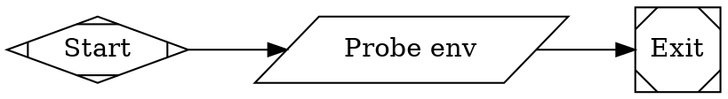

# Task 01 — Vault secret and injection proof

**Depends on:** nothing. **Blocks:** 03, 08. **LLM level:** local is fine.

Prove that a vault secret reaches a **command stage** in a backlog sandbox as an
environment variable, before anything depends on it.

## Part 1 — Create the vault entry

fabro supports exactly one dev token (`dev_token: Option<String>`, and
`dev_token_matches` compares against one expected value), so the bridge reuses the
server's. Read it from the container volume — do not retype it, and do not echo it:

```sh
ssh andrew@10.10.0.32
docker exec fabro-fabro-1 sh -lc \
  'fabro secret set FABRO_API_TOKEN "$(cat /storage/server.dev-token)"'
```

Confirm it exists **by name only**:

```sh
docker exec fabro-fabro-1 fabro secret list | grep FABRO_API_TOKEN
```

If `fabro secret set` is not available in the container build, the vault is reachable
through the API; check `ops/README.md` step 8 for how `GITHUB_TOKEN` and
`LITELLM_API_KEY` were set and follow the same route.

> The token is full-access and cannot be rotated independently of the server's own.
> That limitation is recorded in `00-overview-and-contracts.md`; it is accepted, not
> overlooked.

## Part 2 — Prove injection reaches a command stage

Do **not** prove this by adding a node to `backlog`. Use a throwaway package in
`/tmp/check` on the container, the same way workflows are validated here.

`/tmp/check/workflows/envprobe/workflow.toml`:

```toml
_version = 1

[workflow]
graph = "workflow.fabro"

[run.environment]
id = "python"

[run.environment.env]
FABRO_API_TOKEN = "{{ secrets.FABRO_API_TOKEN }}"
```

`/tmp/check/workflows/envprobe/workflow.fabro`:



**Print the length, never the value.** Stage logs are durable.

Validate, then run it:

```sh
rsync -a --delete ~/Documents/code/fabro-workflows/.fabro/ andrew@10.10.0.32:/tmp/check/
# add the envprobe package to /tmp/check/workflows/ before copying
ssh andrew@10.10.0.32 'docker exec fabro-fabro-1 rm -rf /tmp/check && docker cp /tmp/check fabro-fabro-1:/tmp/check'
ssh andrew@10.10.0.32 'cd ~/fabro && docker compose exec -T fabro fabro validate /tmp/check/workflows/envprobe/workflow.toml'
```

## Acceptance

- `fabro secret list` shows `FABRO_API_TOKEN`.
- The probe stage exits `succeeded` and its log shows a non-zero length.
- **No log line anywhere contains the token value.**

## Why this is a separate task

`{{ secrets.* }}` fails **closed**: a missing or non-token entry aborts run startup
before the sandbox exists, naming the step and the token. Discovering that in the
middle of task 08's live E2E — after a backlog run has already opened a real PR —
wastes a full run to learn something a 30-second probe settles.

The other thing being proved: `[run.environment.env]` is a **sparse override on a
server-catalog environment**. It must add `FABRO_API_TOKEN` to `python` without
redefining the image, resources or anything else. If the probe run comes up on the
wrong image, the override is replacing rather than merging and task 05 needs a
different shape.
